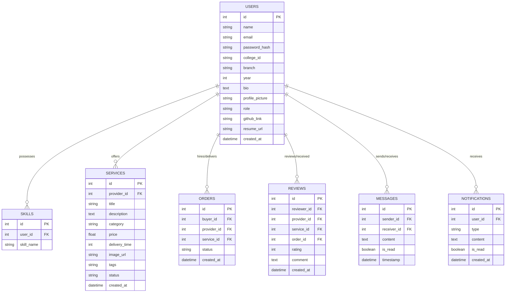
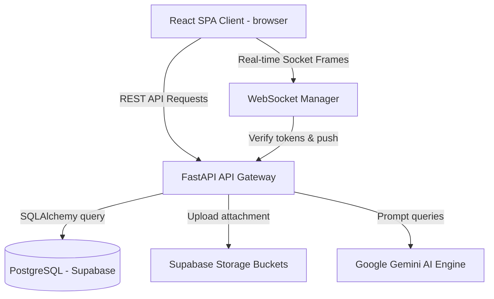

# Servo: Campus Service Marketplace

Servo is a complete, production-ready peer-to-peer student freelancing marketplace (similar to Fiverr but dedicated for college campuses) built with **FastAPI**, **React.js**, **PostgreSQL**, and **Google Gemini AI**. 

It enables students within a university to securely register, build professional profiles, list technical/creative/academic services, hire other students, track task lifecycles, chat in real-time, and get AI-powered optimizations.

---

## 🚀 Key Features

1. **Academic Credential Gate**: Restricts registration to college email IDs and collects student roll numbers, branches, and study years.
2. **Dynamic Service Search**: Full-text keyword searches with branch filters, year filters, price budgets, and rating/popularity sorting.
3. **Real-time Collaboration**: WebSocket connection manager powering instant messaging threads, typing indicators, read receipts, and online alerts.
4. **5-Step Order Stepper**: Track requests through states: `Pending` ➔ `Accepted` ➔ `In Progress` ➔ `Delivered` ➔ `Completed`.
5. **Gemini AI Integrations**:
   - *AI Feature 1: Description Builder*: Generates formatted descriptions from brief inputs.
   - *AI Feature 2: Resume Audit*: Parses CV text to extract key skills, technology tools, and domains.
   - *AI Feature 3: Recommendation Engine*: Scores and ranks listing cards based on student profile interests.
   - *AI Feature 4: Profile optimizer*: Audits profile bio and highlights missing skills.
6. **Admin Command Panel**: Interactive charts summarizing platform statistics (registrations, bookings, ratings) with moderation buttons to delete users, listings, or feedback reviews.

---

## 📊 System Diagrams

### Entity Relationship (ER) Diagram



### System Architecture Diagram



---

## 🛠️ Installation & Local Run Guide

### Option 1: Quick Run with Docker Compose (Recommended)
Prerequisite: Install [Docker Desktop](https://www.docker.com/products/docker-desktop/).

1. Clone or navigate to the project directory:
   ```bash
   cd d:/app
   ```
2. Open `docker-compose.yml` and add your `GEMINI_API_KEY` (or leave blank to fallback to realistic mock responses).
3. Run the orchestration command:
   ```bash
   docker compose up --build
   ```
4. Access the applications:
   - **React Frontend**: `http://localhost:3000`
   - **FastAPI API Swagger Docs**: `http://localhost:8000/docs`
   - **PostgreSQL Database**: Port `5432`

---

### Option 2: Manual Developer Setup (Local CLI)

#### Step A: Backend API setup
1. Navigate to the backend folder:
   ```bash
   cd d:/app/backend
   ```
2. Create and activate a Python virtual environment:
   ```bash
   python -m venv venv
   # On Windows PowerShell:
   .\venv\Scripts\Activate.ps1
   # On macOS/Linux:
   source venv/bin/activate
   ```
3. Install dependencies:
   ```bash
   pip install -r requirements.txt
   ```
4. Configure configurations:
   Create a `.env` file based on `.env.example`:
   ```env
   DATABASE_URL=sqlite:///./servo.db
   JWT_SECRET=supersecretjwtsecretkeychangeinproduction123456
   GEMINI_API_KEY=your-gemini-key
   ```
5. Run the dev server:
   ```bash
   uvicorn app.main:app --reload
   ```

#### Step B: Frontend React setup
1. Navigate to the frontend folder:
   ```bash
   cd d:/app/frontend
   ```
2. Install packages:
   ```bash
   npm install
   ```
3. Run the Vite development server:
   ```bash
   npm run dev
   ```
4. Open your web browser to `http://localhost:5173`.

---

## 🧪 Testing Suite
To execute automated unit and integration tests inside the backend container/local environment:
1. Navigate to the backend folder:
   ```bash
   cd d:/app/backend
   ```
2. Run pytest:
   ```bash
   pytest -v
   ```

---

## 📂 Repository Layout

```text
d:/app/
├── backend/
│   ├── app/
│   │   ├── database/        # DB engines, sessions, models
│   │   ├── routers/         # API Route endpoints
│   │   ├── schemas/         # Pydantic schema serializers
│   │   ├── services/        # WebSockets, Gemini, Supabase
│   │   ├── config.py        # Environment loader
│   │   └── main.py          # App entry and Seeding
│   ├── static/              # Local uploads fallback directory
│   ├── tests/               # Pytest suites
│   ├── Dockerfile
│   └── requirements.txt
├── frontend/
│   ├── src/
│   │   ├── assets/          # SVG logo, media files
│   │   ├── components/      # Navbar, Sidebar, ServiceCard
│   │   ├── context/         # Auth, Chat, Notification contexts
│   │   ├── pages/           # Landing, About, Dashboards, Chat, Profiles
│   │   ├── services/        # Axios wrapper
│   │   ├── App.jsx          # Route definitions
│   │   └── main.jsx
│   ├── Dockerfile
│   ├── tailwind.config.js
│   ├── vite.config.js
│   └── index.html
├── docs/
│   ├── project_report.md    # 10-page final year CSE report
│   └── viva_questions.md    # 25 CSE viva Q&A
├── docker-compose.yml
└── README.md
```

---

## 🎓 Academic Seeding (Mock Data)
On startup, the system automatically inspects if the database is empty. If it is, it inserts:
- **Test Administrator**: `admin@servo.com` (Password: `admin123`)
- **Test Student 1 (Provider)**: `rahul@college.edu` (Password: `student123`)
- **Test Student 2 (Buyer)**: `priya@college.edu` (Password: `student123`)
- **Sample Listings**: Python homework support, Flyer designs, Placement resume helper.
- **Sample Messages**: Thread histories.
- **Sample Reviews**: Testimonials log.
