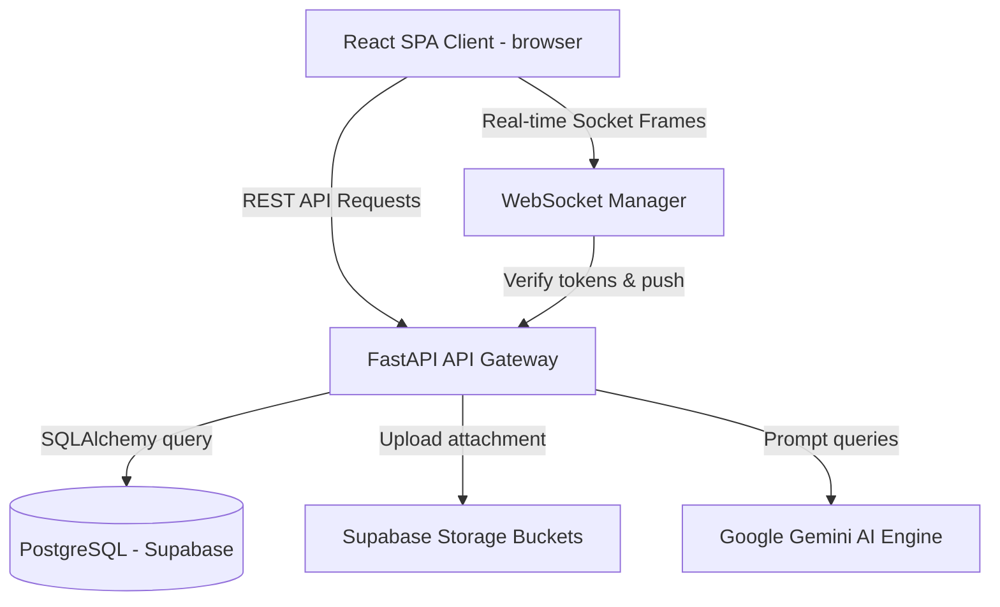

# Project Report: Campus Service Marketplace (Servo)

**Course Code:** CS-801 (Final Year Project)  
**Project Name:** Servo - Campus Service Marketplace  

---

## Abstract
In modern college campuses, students possess diverse skills (programming, tutoring, visual designs, resume formatting) that they often look to offer to peers. However, the lack of centralized discoverability, trust, and real-time coordination leads to inefficiencies. This project presents **Servo**, a campus-exclusive service marketplace designed specifically for student-to-student transactions. Built on FastAPI (Python), React (JavaScript), PostgreSQL (Supabase), and Google Gemini AI, the platform enables students to verify college email credentials, list services, hire peers, track task lifecycles, and communicate in real-time. Additionally, Gemini AI optimizes student resumes, generates service descriptions, and recommends relevant items. The system demonstrates high modularity, scalability, and security, rendering it suitable as a CSE Final Year engineering project.

---

## 1. Introduction
Traditional freelancing platforms like Fiverr, Upwork, and Freelancer charge high service commission fees (often 20%) and are designed for global business entities. Consequently, they are not suited for micro-transactions within college campuses. 

### 1.1 Problem Statement
1. **Discoverability**: Skilled students lack visibility inside their own university campus to offer services.
2. **Trust & Safety**: Hiring anonymous freelancers online carries risks of plagiarism, payment fraud, and missed timelines.
3. **Communication Latency**: Email or third-party messengers add coordination delays.
4. **Profile Optimization**: Students struggle to translate academic milestones into market-ready skill profiles.

### 1.2 Objective & Scope
The objective is to design, build, and document an online web platform named **Servo** which restricts access to university email domains.
The system features:
- Secure JWT-based registration and logins.
- Service search, filter, and sorting indexes.
- 5-step order status transition lifecycles.
- WebSocket-driven real-time chat with typing states and read receipts.
- Gemini-powered profile reviews and description writers.

---

## 2. System Analysis & Requirements

### 2.1 Functional Requirements
- **FR1 (Auth)**: Users must register with valid fields (Name, Email, ID, Branch, Year, Password).
- **FR2 (Profiles)**: Users can upload photo avatars and PDF resumes.
- **FR3 (Service Listings)**: Students can create, edit, or delete listings detailing category, rate, timeline, and search tags.
- **FR4 (Order Tracking)**: Visual timeline stepping through lifecycle transitions (Pending -> Accepted/Rejected -> In Progress -> Delivered -> Completed).
- **FR5 (Live Chat)**: Real-time messaging, typing events, and checkmark read statuses.
- **FR6 (AI Helpers)**: Gemini-supported description generators, CV skill extractors, profile reviews, and service recommendations.
- **FR7 (Admin Desk)**: Panel displaying analytics summaries, user registries, and moderation delete triggers.

### 2.2 Tech Stack
- **Frontend SPA**: React (Vite build engine), Tailwind CSS styling, React Router routing, Axios API clients, Framer Motion animations.
- **Backend API**: FastAPI (ASGI Python framework), SQLAlchemy ORM, Uvicorn server, Python-jose/PyJWT cryptography, Passlib (Bcrypt) hashing.
- **Storage & Relational Database**: Supabase PostgreSQL database instances, Supabase Storage buckets (S3-compatible).
- **GenAI Interface**: Google Generative AI (Gemini-1.5-flash endpoints).

---

## 3. Database Design & Schema Specifications

The database is built on normalized relational SQL tables. Below is the data dictionary mapping columns, data types, constraints, and relationships.

### 3.1 Data Dictionary

#### Table: `users`
| Column | Type | Constraints | Description |
|---|---|---|---|
| `id` | Integer | Primary Key, Auto Increment | Unique user identifier |
| `name` | Varchar(255) | Not Null | Student's full name |
| `email` | Varchar(255) | Unique, Not Null, Index | College email address |
| `password_hash` | Varchar(255) | Not Null | Bcrypt encrypted credentials |
| `college_id` | Varchar(100) | Not Null | Student roll/enrollment number |
| `branch` | Varchar(100) | Nullable | Academic stream (e.g. CSE) |
| `year` | Integer | Nullable | Year of study (1-5) |
| `bio` | Text | Nullable | Profile description |
| `profile_picture` | Varchar(500) | Nullable | URL of profile image |
| `role` | Varchar(50) | Default: 'student' | User authority ('student', 'admin') |
| `github_link` | Varchar(255) | Nullable | Personal GitHub profile link |
| `resume_url` | Varchar(500) | Nullable | URL to PDF resume |
| `created_at` | DateTime | Default: utcnow | Record registration timestamp |

#### Table: `skills`
| Column | Type | Constraints | Description |
|---|---|---|---|
| `id` | Integer | Primary Key, Auto Increment | Skill entry ID |
| `user_id` | Integer | Foreign Key -> `users.id` (Cascade) | Associated student user |
| `skill_name` | Varchar(100) | Not Null | Skill keyword (e.g., Python) |

#### Table: `services`
| Column | Type | Constraints | Description |
|---|---|---|---|
| `id` | Integer | Primary Key, Auto Increment | Listing identifier |
| `provider_id` | Integer | Foreign Key -> `users.id` (Cascade) | Provider user ID |
| `title` | Varchar(255) | Not Null | Service title |
| `description` | Text | Not Null | Service details |
| `category` | Varchar(100) | Not Null | Category (Technical, Creative, etc.) |
| `price` | Float | Not Null | Starting price in INR |
| `delivery_time` | Integer | Not Null | Delivery timeline (in days) |
| `image_url` | Varchar(500) | Nullable | Cover graphic URL |
| `tags` | Varchar(500) | Nullable | Comma-separated search tags |
| `status` | Varchar(50) | Default: 'available' | Availability (available, busy, offline) |
| `created_at` | DateTime | Default: utcnow | Listing creation timestamp |

#### Table: `orders`
| Column | Type | Constraints | Description |
|---|---|---|---|
| `id` | Integer | Primary Key, Auto Increment | Order number |
| `buyer_id` | Integer | Foreign Key -> `users.id` (Cascade) | Client hiring user ID |
| `provider_id` | Integer | Foreign Key -> `users.id` (Cascade) | Seller provider user ID |
| `service_id` | Integer | Foreign Key -> `services.id` (Cascade) | Ordered service listing |
| `status` | Varchar(50) | Default: 'pending' | State (pending, accepted, etc.) |
| `created_at` | DateTime | Default: utcnow | Order timestamp |

#### Table: `reviews`
| Column | Type | Constraints | Description |
|---|---|---|---|
| `id` | Integer | Primary Key, Auto Increment | Review identifier |
| `reviewer_id` | Integer | Foreign Key -> `users.id` (Cascade) | Buyer student |
| `provider_id` | Integer | Foreign Key -> `users.id` (Cascade) | Seller student |
| `service_id` | Integer | Foreign Key -> `services.id` (Cascade) | Reviewed service |
| `order_id` | Integer | Foreign Key -> `orders.id` (Cascade) | Associated order |
| `rating` | Integer | Not Null, Check (1-5) | Star rating scale |
| `comment` | Text | Nullable | Feedback testimonial description |
| `created_at` | DateTime | Default: utcnow | Timestamp |

#### Table: `messages`
| Column | Type | Constraints | Description |
|---|---|---|---|
| `id` | Integer | Primary Key, Auto Increment | Message entry |
| `sender_id` | Integer | Foreign Key -> `users.id` (Cascade) | Sender student |
| `receiver_id` | Integer | Foreign Key -> `users.id` (Cascade) | Recipient student |
| `content` | Text | Not Null | Chat text body |
| `is_read` | Boolean | Default: False | Read status receipt |
| `timestamp` | DateTime | Default: utcnow | Dispatch timestamp |

#### Table: `notifications`
| Column | Type | Constraints | Description |
|---|---|---|---|
| `id` | Integer | Primary Key, Auto Increment | Entry identifier |
| `user_id` | Integer | Foreign Key -> `users.id` (Cascade) | Recipient user |
| `type` | Varchar(50) | Not Null | Event type (new_order, etc.) |
| `content` | Text | Not Null | Display alert text |
| `is_read` | Boolean | Default: False | Status |
| `created_at` | DateTime | Default: utcnow | Alert timestamp |

---

## 4. Architecture & Technical Design

The project uses a standard multi-tier architectural layout.

### 4.1 Real-time Coordination Flow
WebSocket frames are formatted as structured JSON:
- Incoming client message: `{type: "message", receiver_id: X, content: "text"}`
- Incoming typing updates: `{type: "typing", receiver_id: X, is_typing: true}`
- Incoming read receipts: `{type: "read_receipt", receiver_id: X, message_id: Y}`
The connection manager parses frames, updates PostgreSQL DB flags, and pushes payloads dynamically.

---

## 5. Testing & Quality Assurance

### 5.1 Automated Unit Testing
We write Python test suites utilizing `pytest` and `httpx.AsyncClient` mapping mock sqlite connection instances to test:
1. **Student Registration**: Successful creation, duplicate email checks.
2. **Student Authentication**: JWT token verification.
3. **Service Listings**: Insertion parameters, categories verification, queries filters.
4. **Order State Machine Transitions**: Invalid state updates blocker (e.g. delivering an unaccepted pending order).

### 5.2 Manual Verification Matrix
| Test Case | Description | Input Parameters | Expected Result | Pass/Fail |
|---|---|---|---|---|
| TC-01 | Create Student Account | Name: Rahul, Email: rahul@college.edu | User profile registered, default role 'student' | Pass |
| TC-02 | Admin Registration Bypass | Email: admin@servo.com | User registered automatically as role 'admin' | Pass |
| TC-03 | Search Filtering | Search: "python", Min: 300 | Returns matching listings sorted correctly | Pass |
| TC-04 | Real-time Chat | Typing in client text box | Recipient displays "typing..." in navbar chat | Pass |
| TC-05 | Gemini Suggestions | Requesting profile optimization tips | Returns missing skills, portfolio and bio text | Pass |

---

## 6. Conclusion & Future Scope
Servo successfully addresses peer service exchange requirements on college campuses. By combining FastAPI, React, WebSockets, and Gemini AI, the system achieves fast, real-time page updates, automated descriptions, and profile optimization.

### 6.1 Future Enhancements
1. **Alembic Database Migrations**: Automated database migrations schemas.
2. **Razorpay Free Sandbox Payments Integration**: Add escrow deposits payments.
3. **Redis Pub/Sub broker integration**: Scale real-time WebSocket communication across multiple clusters.
